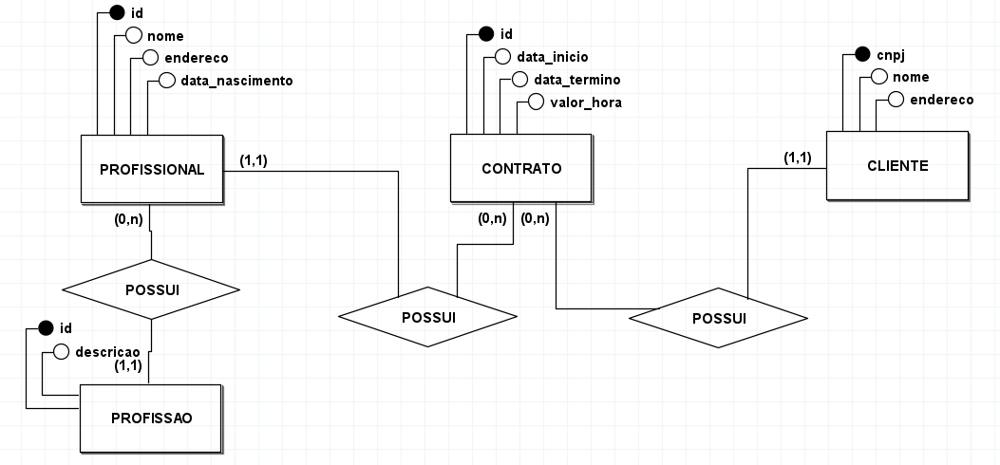
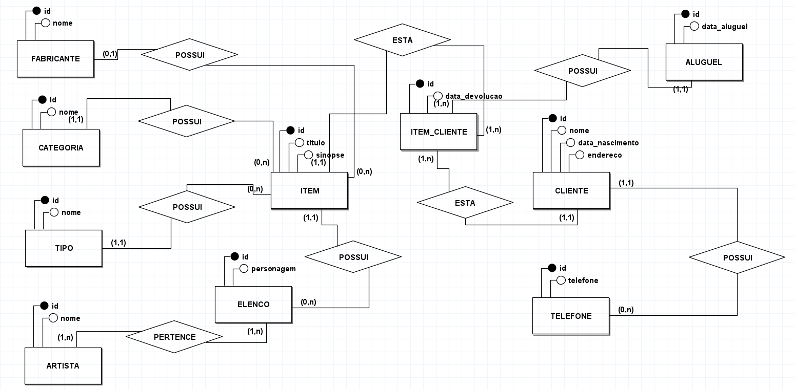
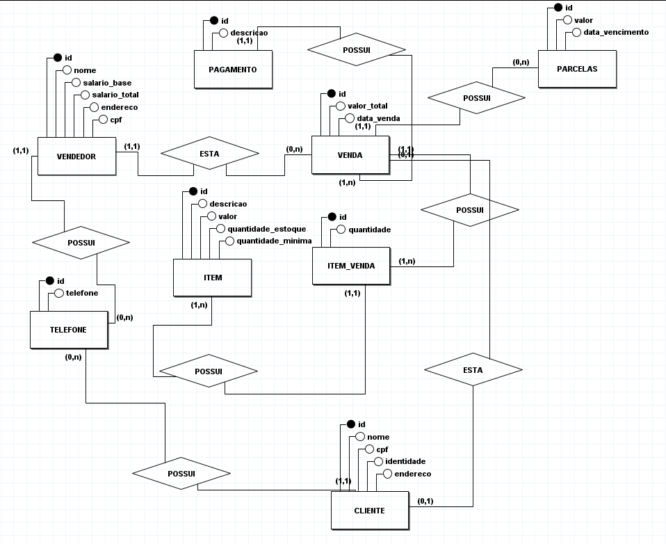

## Cliente Profissional

Uma empresa de agenciamento de mão-de-obra pretende informatizar o seu cadastro de profissionais, candidatos a empregos temporários, objetivando construir um banco de dados onde possa manter os dados cadastrais dos profissionais e seus contratos temporários com as empresas clientes. O profissional é identificado por um número de controle e, além dessa informação, ficam registrados o seu nome, endereço, nascimento e profissão. 
Os contratos de mão-de-obra temporária são feitos individualmente (um contrato para cada profissional) com as empresas clientes. Cada contrato é identificado por um número único e nele são registrados a empresa contratante, a vigência do contrato (data de início e de término) e o valor pago por hora trabalhada. 
As empresas clientes são identificadas por um C.G.C. e possuem um nome e endereço. 
Fazer um DER que apresente uma solução para o problema.

## Cliente Locadora

Uma vídeo-locadora trabalha com o aluguel de DVDs, BDs e cartuchos de jogos. Todos os 3 tem um código, o título que o descreve e a categoria. Adicionalmente, os DVDs e os BDs possuem a sinopse e os artistas principais. Já os cartuchos de jogos, possuem adicionalmente apenas o nome do fabricante. 
A locadora empresta apenas para os clientes cadastrados. Nome, endereço, data de nascimento e telefones dos clientes ficam anotados em uma ficha junto com um código numérico sequencial atribuído ao cliente no momento do cadastro. 
Cada cliente pode alugar um ou mais objetos de locação (DVD, BD ou Cartucho), sendo que cada um destes só pode ser alugado por apenas 1 cliente em um determinado momento (data). É interesse da locadora, entretanto, manter um histórico dos aluguéis já realizados, a fim de gerenciar o perfil dos seus clientes.

## Vendedor Venda

A fim de gerenciar as vendas em uma loja, os seguintes requisitos devem ser atendidos pela modelagem de dados:
- Vendas são efetuadas por um Vendedor em um determinado momento (indicado por uma data e um horário). Vendedores recebem um salário base e comissão sobre as vendas, a qual representa 10% do valor da venda.
- Vendedores possuem matrícula, nome, endereço, telefone e CPF. Vendedores podem possuir mais de um telefone.
- Vendas podem ser à vista ou a prazo. Vendas a prazo possuem parcelas de pagamento, com sua data de vencimento e valor.
- Vendas podem ou não estar relacionadas a um Cliente. Vendas em dinheiro nem sempre estão relacionadas a um Cliente.
- Clientes são cadastrados com seu Nome, CPF, Identidade, Endereço e Telefone. Clientes podem possuir mais de um telefone.
- Vendas envolvem produtos, sendo que para cada venda a quantidade vendida do produto deve ser registrada.
- Produtos possuem código, descrição, preço e quantidade em estoque.

