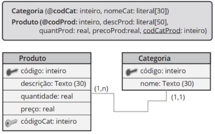

<h1 align="center">
  📃<br>Script SQL
</h1>

<details>
<summary>✨ Conceitos</summary>

- Banco de Dados: São coleções de informações que se relacionam de forma que crie um sentido.

- Dados: Dados representam um ou mais significados que, de forma isolada, não conseguem ainda transmitir uma mensagem clara.

- Informações: São os dados devidamente tratados e analisados, produzindo conhecimento relevante.

- Conhecimento: É a informação com um contexto bem definido, processado de forma efetiva pelos profissionais.

- SGBD: Sistema de Gerenciamento de banco de dados (SGBD) é um software que incorpora e facilita as funções de definição, recuperação e alteração de dados em um Banco de Dados.

- Modelo de Organização:
## Modelo Hierárquico
<h6 align="center">

</h6>

## Modelo Rede


## Modelo Relacional


## Modelo Orientado a Objetos


</details>

<details>
<summary>📒 Projeto de banco de dados</summary>

- Três níveis de abstração (necessário realizar o mapeamento entre os três modelos):

## Modelo Conceitual (DER)


## Modelo Lógico (Esquema do BD)

## Modelo Físico (Script do BD em SQL)


</details>

<details>
<summary>🗂️ Criação de Batabase</summary>
- Comunicação do Banco de Dados H2: `resources/application.properties`

    ```
    spring.datasource.url=jdbc:h2:mem:testdb
    spring.datasource.username=sa
    spring.datasource.password=

    spring.h2.console.enabled=true
    spring.h2.console.path=/h2-console

    spring.jpa.show-sql=true
    spring.jpa.properties.hibernate.format_sql=true
    ```
</details>