<h1 align="center">
  📃<br>Script SQL
</h1>

<details>
<summary>✨ Conceitos</summary>

- Banco de Dados: São coleções de informações que se relacionam de forma que crie um sentido.

- Dados: Dados representam um ou mais significados que, de forma isolada, não conseguem ainda transmitir uma mensagem clara.

- Informações: São os dados devidamente tratados e analisados, produzindo conhecimento relevante.

- Conhecimento: É a informação com um contexto bem definido, processado de forma efetiva pelos profissionais.

- SGBD: Sistema de Gerenciamento de banco de dados (SGBD) é um software que incorpora e facilita as funções de definição, recuperação e alteração de dados em um Banco de Dados.

- Modelo de Organização:
## Modelo Hierárquico


## Modelo Rede
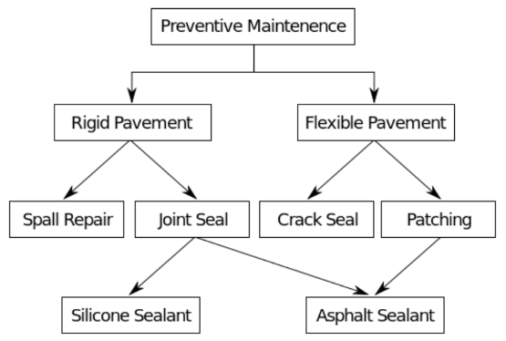

## Modelo Relacional
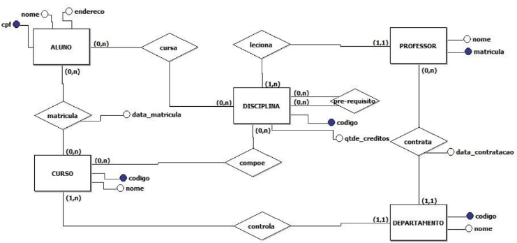

## Modelo Orientado a Objetos
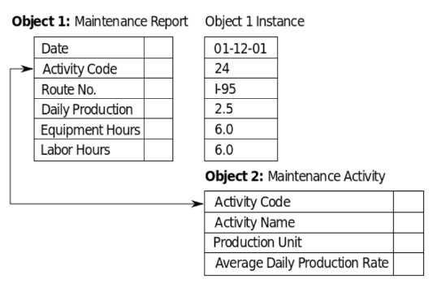

## Structured Query Language (SQL)
- DDL: Linguagem de Definição de Dados.

- DML: Linguagem de Manipulação de Dados.

- DCL: Linguagem de Controle de Dados.

- DTL: Linguagem de Controle de Transações.

</details>

<details>
<summary>📒 Projeto de banco de dados</summary>

- Três níveis de abstração (necessário realizar o mapeamento entre os três modelos):

## Modelo Conceitual (DER)
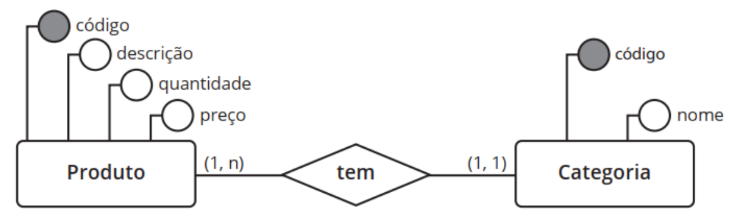

## Modelo Lógico (Esquema do BD)

## Modelo Físico (Script do BD em SQL)
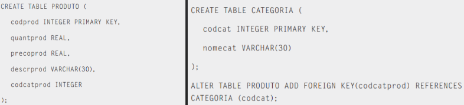

## Entidades
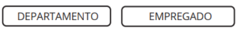

## Atributos
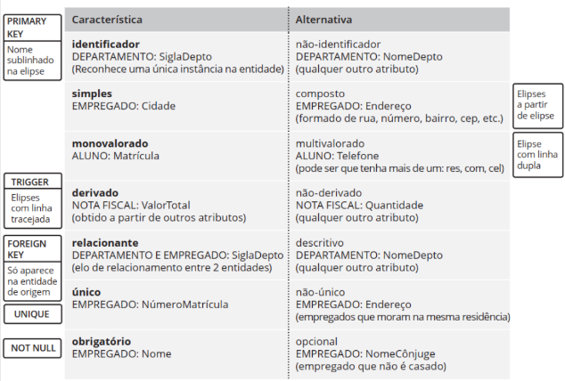

## Relacionamentos
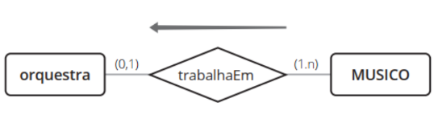

## Restrições Relacionamentos

- Restrições em relacionamento: Existem 3 variações possíveis.

- 1:1 – cada instância de uma entidade relaciona-se com uma e somente uma instância da outra.

- 1:N (ou N:1) – uma instância relaciona-se com várias na outra entidade, mas cada instância da outra entidade só pode estar relacionada a uma única ocorrência da primeira entidade.

- N:N (ou N:M) – uma instância relaciona-se com várias ocorrências na outra entidade, e vice-versa.

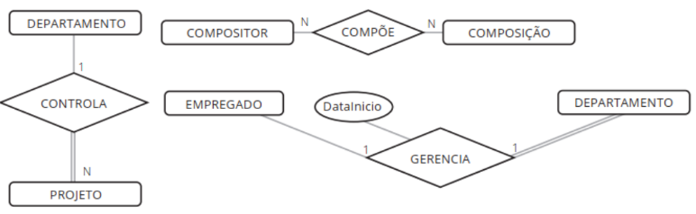

## CrowsFoot
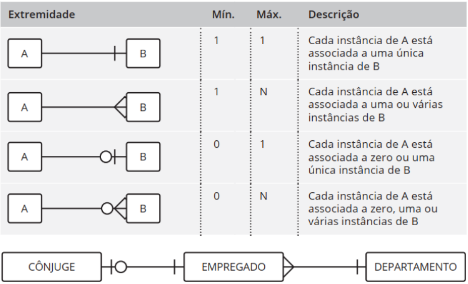

## Grau do Relacionamento

- Grau do Relacionamento:

- Unário (grau 1): relacionamento com a própria entidade, também chamado de relacionamento recursivo ou autorrelacionamento.

- Binário (grau 2): mais comum.

- Ternário (grau 3): maior complexidade.

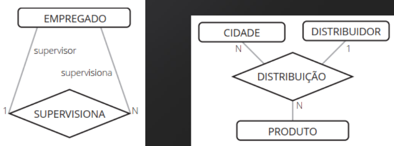

## Generalização/especialização

- Generalização/especialização:

- Total (t): toda ocorrência da entidade genérica deverá estar associada a uma ocorrência de uma de suas entidades especializadas;

- Parcial (p): nem toda ocorrência da entidade genérica possui uma ocorrência em uma de suas entidades especializadas;

- Exclusiva (x): uma ocorrência de entidade genérica é especializada no máximo uma vez;

- Compartilhada (c): uma ocorrência da entidade genérica pode aparecer em várias de suas entidades especializadas.

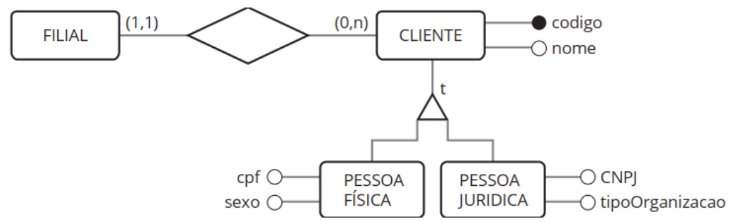

## Entidade associativa
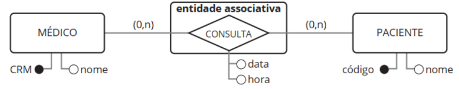

## Ferramenta brModelo
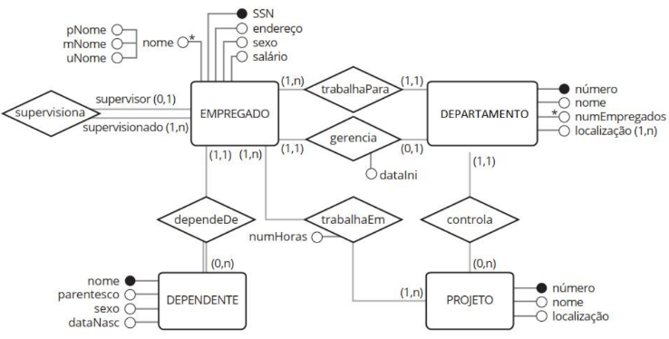

</details>

<details>
<summary>🗂️ Exemplos de SQL</summary>

- Estrutura da SQL - DDL

## CREATE
```
CREATE DATABASE empresa
    WITH
    OWNER = postgres
    ENCODING = 'UTF8'
    CONNECTION LIMIT = -1
    IS_TEMPLATE = False;
```

## ALTER
```
ALTER TABLE departamento
    ADD CONSTRAINT fk_departamento_funcionario
    FOREIGN KEY (codigo_funcionario)
        REFERENCES public.funcionario (codigo) MATCH SIMPLE
        ON UPDATE CASCADE
        ON DELETE NO ACTION;
```

## DROP
```
DROP DATABASE empresa;
```

- Estrutura da SQL - DML (CRUD)

## INSERT
```
INSERT INTO departamento (nome, localizacao, codigo_funcionario) VALUES
	('RH', 'Setor 1', 1),
	('Marketing', 'Setor 2', 2),
	('Gestão', 'Setor 3', 3),
	('Vendas', 'Setor 4', 4);
```

## SELECT
```
SELECT *
	FROM fruta_a;
```

## UPDATE
```
UPDATE cliente
    SET nome = “Saitama” WHERE id_cliente = 18;
```

## DELETE
```
DELETE FROM venda WHERE status = 1;
```

## TRUNCATE
```
TRUNCATE pedido CASCADE;
```

- Estrutura da SQL - DCL
## GRANT

## REVOKE

- Estrutura da SQL - DTL

## BEGIN TRANSACTION

## COMMIT

## ROLLBACK

</details>